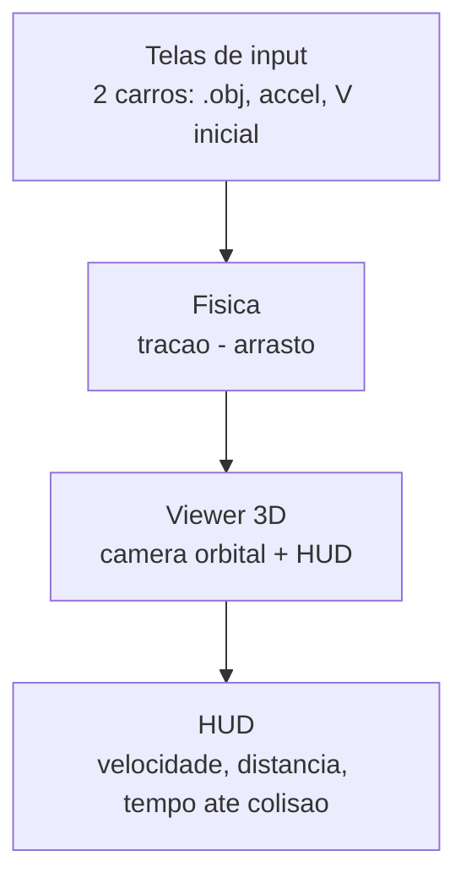

# project_cars

Comecei jogando Forza Horizon 6. Numa reta, colado atrás de outro carro, meu carro ganhava velocidade sem eu fazer nada. Vácuo. Todo mundo sabe que existe, mas fiquei preso numa pergunta: de onde vem esse ganho, e o que acontece quando os carros não têm o mesmo tamanho? Um hatch atrás de uma picape pega vácuo inteiro, tudo bem. Mas a picape atrás do hatch, pega quanto?

Esse projeto é a tentativa de ver isso acontecer, em vez de só ler a fórmula.

## A ideia

Dois carros 3D, um atrás do outro, cada um com sua aceleração base e velocidade inicial. Aperta run e eles saem acelerando juntos. A distância entre eles abre ou fecha dependendo da forma de cada carro, da aceleração de cada um, e do quanto o de trás consegue se esconder atrás do da frente. Se ele alcança, colide, e a simulação termina.

Nada disso é regra escrita à mão: você carrega a malha, o programa mede a geometria, e o comportamento emerge daí.

## O que dá pra ver

- **O carro pega cor** conforme o ângulo de cada face com o vento: vermelho de frente, neutro de lado, azul na esteira.
- **A esteira tem tamanho**, proporcional à área frontal do carro da frente: carro grande projeta sombra grande.
- **O vácuo não é tudo ou nada.** Só recebe alívio a parte do carro de trás que cabe dentro da sombra. O que transborda, em largura ou altura, continua tomando vento cheio. Por isso um carro pequeno atrás de um grande dispara pra alcançar, enquanto um caixote atrás de um carro pequeno mal sente o vácuo. E o alívio decai com a distância: forte logo atrás, some conforme abre.

## Como usar

Carrega dois objetos 3D (`.obj` ou `.stl`), define aceleração base e velocidade inicial de cada um, e clica em Run. Abre uma cena 3D com câmera orbital, os carros aceleram em tempo real e um HUD mostra velocidade, distância e tempo até a colisão. Ao terminar, volta pra tela de input com os dados preservados.

---

## Parte técnica

### Física

O arrasto de cada carro segue a fórmula clássica:

```
arrasto = ½ · ρ · Cd · A · v²
```

onde `A` é a área frontal calculada a partir da própria malha 3D. A aceleração resultante é tração menos arrasto.

A coloração vem do ângulo entre a normal de cada face e a direção do movimento (`cos²θ`). É um **proxy geométrico**, não CFD. Roda em tempo real e ainda assim mostra, de forma fisicamente motivada, onde há mais e menos atrito.

### Drafting

O alívio de arrasto combina dois fatores:

- **Fração na sombra:** quanto da área frontal do carro de trás se sobrepõe à esteira do da frente (largura e altura). A parte de fora sofre arrasto cheio.
- **Força da esteira:** decai com a distância entre os dois.

As projeções por enquanto são aproximadas por retângulos de área equivalente. A silhueta exata fica como refinamento posterior.

### Stack

- **Python**
- **PySide6** (Qt): telas de input e janela principal
- **pyvistaqt**: embute a cena do PyVista na janela Qt
- **PyVista / VTK**: render 3D, câmera orbital, simulação em tempo real
- Upload de malha em `.obj` / `.stl`

```bash
pip install PySide6 pyvista pyvistaqt
```

### Arquitetura

Um `QStackedWidget` troca entre a tela de input (índice 0) e a cena 3D (índice 1). O botão Run troca pro 3D e, ao terminar, volta pro input sem perder os dados.



```
project_cars/
├── main.py          # costura tudo
├── ui.py            # telas de input
├── physics.py       # motor de fisica (so numeros)
├── mesh_loader.py   # carrega .obj/.stl
├── viewer.py        # cena 3D + camera
└── models/          # .obj de teste
```

### Status

Construindo as telas de input em PySide6 (`ui.py`): o `QStackedWidget` com a tela de input e um placeholder pra cena 3D. Física e PyVista entram depois que a navegação entre telas estiver funcionando.
