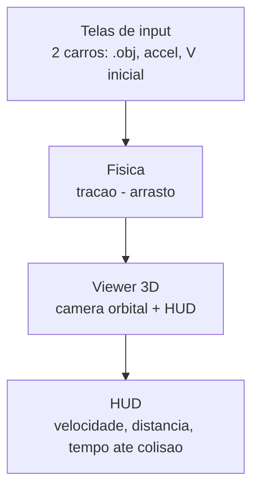

# project_cars

Simulador em Python que coloca dois carros 3D **um atrás do outro**, na mesma linha, e mostra como o **arrasto aerodinâmico** muda a distância entre eles até a colisão, quando o de trás alcança o da frente.

Cada carro tem sua própria aceleração base e velocidade inicial, definidas pelo usuário. O arrasto depende da forma de cada carro e cresce com a velocidade. Como os carros estão em fila, o de trás ainda pode entrar na esteira do da frente e ganhar velocidade (drafting). A diferença entre eles (forma, aceleração, velocidade inicial) e o efeito da esteira fazem a distância abrir ou fechar, e quando o de trás alcança o da frente, há colisão.

## Como funciona

O usuário carrega dois objetos 3D (`.obj` / `.stl`), define aceleração base e velocidade inicial de cada um, e clica em rodar. Abre uma cena 3D com câmera orbital onde os carros aceleram em tempo real.

## Stack

- **Python**
- **PySide6** (Qt) — telas de input e janela principal
- **pyvistaqt** — embute a cena 3D do PyVista dentro da janela Qt
- **PyVista / VTK** — render 3D, câmera orbital, simulação em tempo real
- Upload de malha em `.obj` / `.stl`

```bash
pip install PySide6 pyvista pyvistaqt
```

A UI usa um `QStackedWidget`: uma janela só que troca entre a tela de input (índice 0) e a cena 3D (índice 1). Botão "Run" troca pro 3D; ao terminar, volta pro input. Os dados ficam preservados.

## Fluxo



## Esteira e resistência do ar

O ponto central do projeto é calcular e visualizar a **esteira de baixa pressão** (*wake*) que se forma atrás do carro, e o atrito com o ar ao longo da carroceria.

Para cada face da malha, calcula-se o ângulo entre a normal e a direção do movimento (`cos²θ`):

- Faces de frente para o vento → muito atrito → **vermelho**
- Faces de lado → neutro
- Faces atrás, na esteira de baixa pressão → **azul**

A força de arrasto que freia o carro é `arrasto = ½ · ρ · Cd · A · v²`, onde `A` é a área frontal calculada a partir da própria malha 3D.

> A coloração é um **proxy geométrico** (`cos²θ`), não um campo de pressão resolvido por CFD. Mostra de forma fisicamente motivada onde há mais e menos atrito, rodando em tempo real.

## Drafting (vácuo entre os carros)

O carro de trás recebe alívio de arrasto quando entra na esteira do da frente — o efeito de *drafting* que se vê na Fórmula 1. Mas o alívio **não pega o carro de trás inteiro**: só a parte dele que cabe dentro da sombra da esteira.

A esteira é uma sombra no plano frontal (largura × altura), com tamanho baseado na área frontal do carro da frente. O alívio combina dois fatores:

- **Fração na sombra:** quanto da área frontal do carro de trás se sobrepõe à esteira do da frente (interseção das duas projeções, em largura e altura). A parte fora da sombra sofre arrasto cheio.
- **Força da esteira:** decai com a distância, forte logo atrás, dissipa-se mais longe.

Assim, um retângulo gigante atrás de um carro pequeno transborda a esteira em largura e altura, só o miolo dele pega vácuo, o alívio total é pequeno e ele não alcança. Já um carro pequeno atrás de um grande cabe inteiro na sombra, recebe alívio forte e dispara para alcançar. O comportamento emerge do tamanho relativo das silhuetas.

> Para começar, as projeções são aproximadas por retângulos de área equivalente (interseção trivial de calcular). A silhueta exata fica como refinamento posterior.

## Estrutura

```
project_cars/
├── main.py          # costura tudo
├── ui.py            # telas de input
├── physics.py       # motor de fisica (so numeros)
├── mesh_loader.py   # carrega .obj/.stl
├── viewer.py        # cena 3D + camera
└── models/          # .obj de teste
```

## Status

Construindo as **telas de input** em PySide6 (`ui.py`): `QStackedWidget` com a tela de input e um placeholder pra cena 3D. A física e o PyVista entram depois que a navegação entre telas estiver funcionando.
