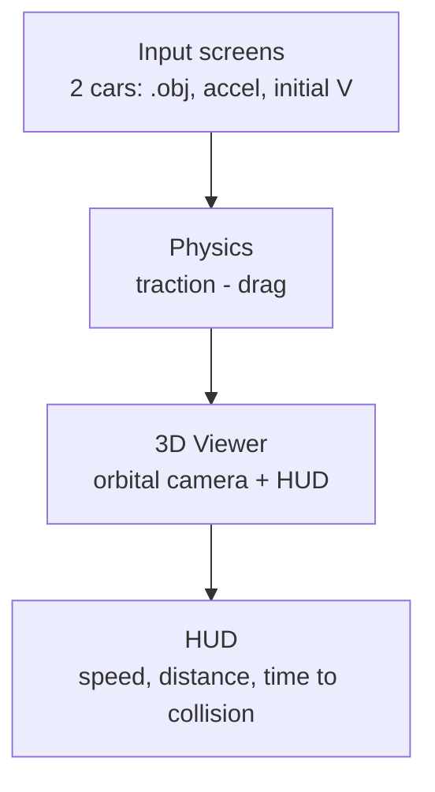

# project_cars
I started playing Forza Horizon 6. On a straightaway, tucked right behind another car, my car would gain speed without me doing anything. Draft. Everyone knows it exists, but I got stuck on a question: where does that gain come from, and what happens when the cars aren't the same size? A hatchback behind a pickup gets the full draft, sure. But the pickup behind the hatchback, how much does it get?

This project is an attempt to see that happen, instead of just reading the formula.

## The idea
Two 3D cars, one behind the other, each with its own base acceleration and initial speed. Hit run and they take off accelerating together. The gap between them opens or closes depending on each car's shape, each one's acceleration, and how much the rear car manages to hide behind the front one. If it catches up, they collide, and the simulation ends.

None of this is hand-written rules: you load the mesh, the program measures the geometry, and the behavior emerges from that.

## What you can see
- **The car takes on color** based on the angle of each face relative to the wind: red at the front, neutral on the sides, blue in the wake.
- **The wake has a size**, proportional to the frontal area of the car ahead: a big car casts a big shadow.
- **Drafting isn't all-or-nothing.** Only the part of the rear car that fits inside the shadow gets relief. Whatever overflows, in width or height, still takes full wind. That's why a small car behind a big one surges to catch up, while a boxy vehicle behind a small car barely feels the draft. And the relief decays with distance: strong right behind, fading as the gap opens.

## How to use it
Load two 3D objects (`.obj` or `.stl`), set base acceleration and initial speed for each, and click Run. A 3D scene opens with an orbital camera, the cars accelerate in real time, and a HUD shows speed, distance, and time to collision. When it ends, it goes back to the input screen with the data preserved.

---
## Technical part
### Physics
Each car's drag follows the classic formula:
```
drag = ½ · ρ · Cd · A · v²
```
where `A` is the frontal area calculated from the 3D mesh itself. The resulting acceleration is traction minus drag.

The coloring comes from the angle between each face's normal and the direction of motion (`cos²θ`). It's a **geometric proxy**, not CFD. It runs in real time and still shows, in a physically motivated way, where there's more and less drag.

### Drafting
The drag relief combines two factors:
- **Fraction in the shadow:** how much of the rear car's frontal area overlaps with the front car's wake (width and height). The part outside takes full drag.
- **Wake strength:** decays with the distance between the two cars.

The projections are currently approximated by rectangles of equivalent area. The exact silhouette remains a later refinement.

### Stack
- **Python**
- **PySide6** (Qt): input screens and main window
- **pyvistaqt**: embeds the PyVista scene inside the Qt window
- **PyVista / VTK**: 3D rendering, orbital camera, real-time simulation
- Mesh upload in `.obj` / `.stl`
```bash
pip install PySide6 pyvista pyvistaqt
```

### Architecture
A `QStackedWidget` switches between the input screen (index 0) and the 3D scene (index 1). The Run button switches to 3D and, when it ends, returns to the input screen without losing the data.



```
project_cars/
├── main.py          # ties everything together
├── ui.py            # input screens
├── physics.py       # physics engine (numbers only)
├── mesh_loader.py   # loads .obj/.stl
├── viewer.py        # 3D scene + camera
└── models/           # test .obj files
```

### Status
Building the input screens in PySide6 (`ui.py`): the `QStackedWidget` with the input screen and a placeholder for the 3D scene. Physics and PyVista come in once navigation between screens is working.
